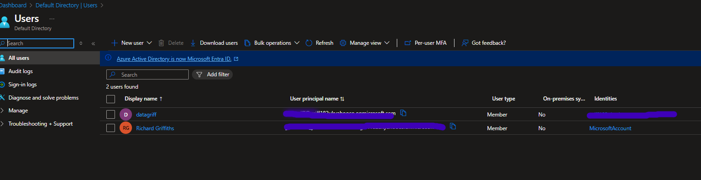
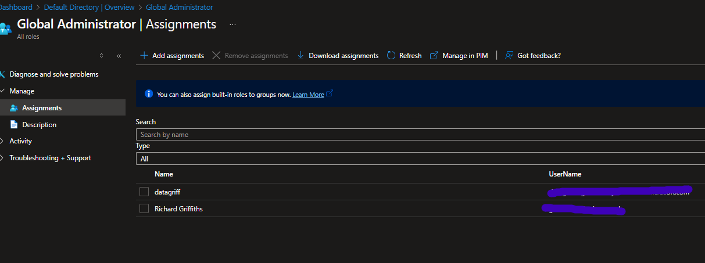
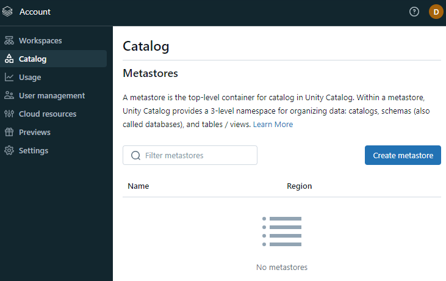
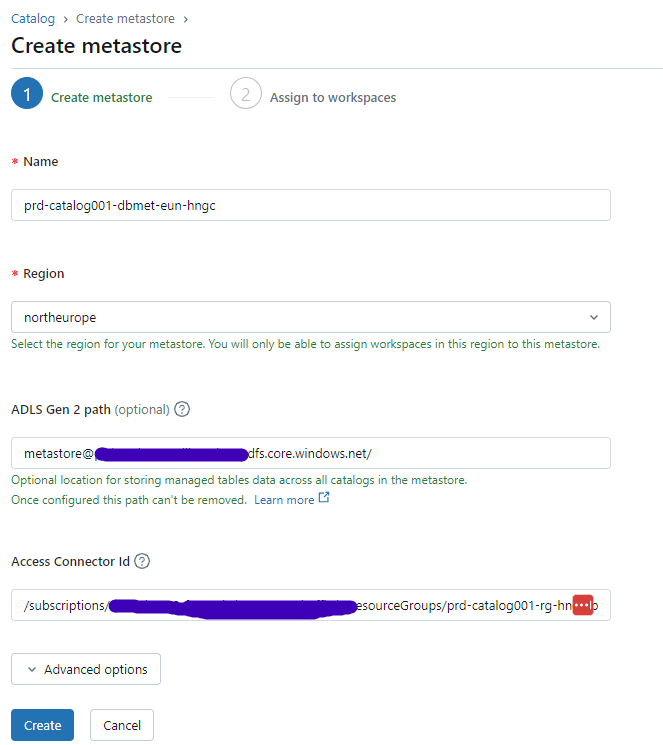

# Data Catalog

- [Data Catalog](#data-catalog)
  - [Purpose](#purpose)
  - [Deployed Assets](#deployed-assets)
  - [Contribute](#contribute)
  - [Manual Steps](#manual-steps)
    - [Fix - Extra User In Order to Access Catalog](#fix---extra-user-in-order-to-access-catalog)
    - [Creating Unity Catalog](#creating-unity-catalog)
    - [Adding Workspaces to Unity Catalog](#adding-workspaces-to-unity-catalog)
    - [Create Metastore Admin Permissions](#create-metastore-admin-permissions)
    - [Assign Main (default) Catalog Permissions](#assign-main-default-catalog-permissions)

## Purpose

This platform is used to provide a virtualised data governance catalog over all the domain data.

## Deployed Assets

- Storage Account to Act as Default for Metastore
- Databricks Access Connector
- RBAC for the Databricks Access Connector
- Databricks Unity Catalog (manual)

## Contribute

You can contribute to the terraform in this data_catalog directory.
Please note the following:

- Unity catalog can only be one per region per account. Therefore this is only deployed once and into production.
- We may do work to setup a West Europe Unity Catalog in the future - but this will depend on changing all other development resources to point at West Europe.
- Unity catalog is setup as per the manual process below.
- Adding workspaces to unity catalog occurs as per the manual process below.

## Manual Steps

### Fix - Extra User In Order to Access Catalog

TODO: - Want to automate

Due to [this ongoing issue with azure databricks account level access](https://community.databricks.com/t5/administration-architecture/unable-to-login-to-azure-databricks-account-console/m-p/83658/highlight/true#M1613), highlighted and solved in git hub [here](https://github.com/cloudboxacademy/azure_databricks_course/blob/main/known-issues/unable-to-login-to-azure-databricks-account-console.md), have had to create an extra global admin user as per below.

Login in to [databricks account](https://accounts.azuredatabricks.net/) with this account and perform the tasks below with this account.
This is very strange behaviour from azure and databricks as my own account does have the same access.

### Creating Unity Catalog

TODO: - Want to automate

Login in to [databricks account](https://accounts.azuredatabricks.net/) with the account above.

### Adding Workspaces to Unity Catalog

TODO: - Want to automate

Login in to [databricks account](https://accounts.azuredatabricks.net/) with the account above.

### Create Metastore Admin Permissions

TODO: - Want to automate

### Assign Main (default) Catalog Permissions

TODO: - Want to automate

